# SHOWCASE

The Showcase website is a page for music enthusiasts who easily want to find concerts and other evets and who wish that everything was gathered in one place instead of having to look around on several different pages to find their tickets.

Users will find all the information they need on the website. All upcoming gigs are displayed with information about the band/artist, date, time, place and ticket price. When the users have found a ticket they wish to buy, they're easily linked to the page that sells the ticket.

The website also has information about Showcase and the vision behind it all. Users also have the option to sign up for a newsletter so they will be first to receive information about new events.

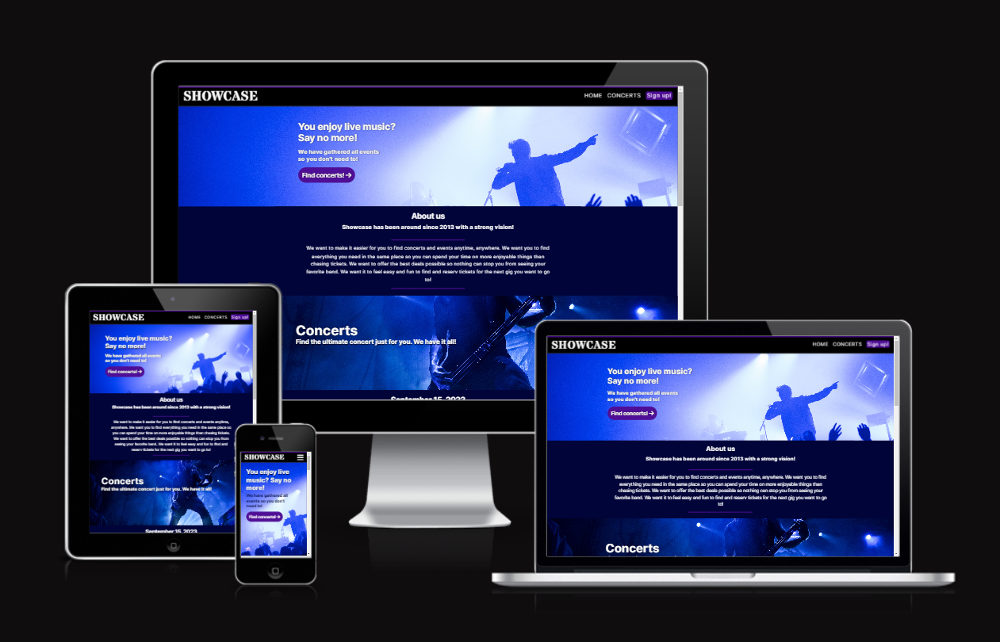

### You can find the project live [here](https://ramonabroberg.github.io/showcase/)

# UX

- The website is made for people interested in music who usually go to concerts and other events and are used to using social media and electronic devices as part of their everyday life.

# User stories

The goals is as follows:

- The users want a user-friendly website that feels safe and easy to navigate no matter what kind of device they're using.
- The users want a good first impression of the website.
- The users want to be able to understand the purpose of the website from the start.
- The users want to easily find upcoming concerts and events and feel asured that they're nt missing out on something.
- The users want to quickly be able to see information about band/artist, time & place and tickets prices.
- The users want to find all tickets and information they need from the same page instead of having to look on multiple websites to find the tickets they want.
- The users want to be able to contact Showcase if they have any questions.

## Strategy

The goal is to create a user-friendly and easily accessible website that appeals to the user. It should be easy to navigate and to understand where the information you want is located.

The main focus of the website is the list of available concerts and events so it should be easy for the user to get there.

The users should also feel included and that they're not missing any events.

## Scope

The users should easy find the section where upcoming concerts is located.

The listed concerts should link to the page selling the tickets in a new tab so the users still stay on the website.

To make the users feel included they should be able to sign up for a newsletter that gives them updates about upcoming events.

## Structure

The website has a single page design. The navigation is fixed at the top so it's always visible and it has links to the different sections of the website that can be used from anywhere on the page.

__Sections of the website:__

- __HOME__
  - Hero image to get the users attention.
  - On the hero image there is a descriptive text so the users instantly know what the website is all about.
  - A button that links to the Concerts section to make it extra easy for the users to find the information they're looking for.
  - About us section that has information about Showcase to make the users trust the website and feel secure.
  
- __CONCERTS__
  - Concerts listed and styled so it's easy to read and find the information the users are looking for.
  - Each event has a button that links to the specific website that sells the tickets.

- __Sign up!__
  - A form that makes it possible for users to sign up to the newsletter. The form only asks for an email address and it's mandatory. It doesn't accept anything but an email adress and will inform the user about it if it's not.

## Skeleton

The website is designed to be easy to understand and navigate. The information on the website are placed in a ranking order with the most important at the top and then gradually goes down as you go further down the page.

The wireframe is designed using Balsamiq software and is displayed as one long page with the different sections of the website on top of each other.

#### [Click here](assets/readme/wireframe.png) to see the wireframe

## Surface

The fonts used is Stardos Stencil for the navigation title and Inter for the rest of the text on the website.

The color palette is in blue and purple shades as a consistent theme to give the user a comforting feeling of the website. Details and fonts are in black and white.

_Color palette:_

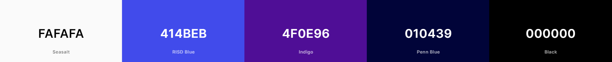

# Technologies

1. HTML - To create a site
2. CSS - To style the website and make it enjoyable to visit and navigate through
3. Balsamic - To create a wireframe

# Features

## Existing features

### __Navigation__

- The navigation is fixed and shows the company name on the left, this links to the top of the page.
- The other links are to the right and is called "Home", "Concerts" and "Sign up!", they link to different parts of the website.
- The fonts are easy to read and there is good contrast between the fonts and the background color.
- The navigation is clear and displayed with full names as menu options on large screens.
- On smaller screens such as mobile phones, the navigation has a menu icon. When you click on the icon the menu folds out and shows the same menu options as on larger screens.
- To make the "Sign up!" section stand out, it has lowercase letters and a purple background so it looks like a button.

How the navigation looks on larger screens

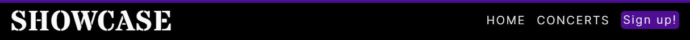

How it looks on smaller devices

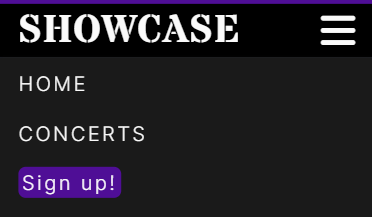

### __Home__

- The hero image of the Home page is a blue image of a concert with cheering audience to set a good impression to the user regarding the website and it's purpose right from the start.
- On the image you see the text "You enjoy live music? Say no more! We have gathered all events so you don't need to!" to further describe the purpose of the website to make it easy for users to know what kind of website it is.
- There is a button that links to the "Concerts" section of the page to easy get the users to the main purpose of the site which is to make them find the concerts they are looking so they can secure their tickets.

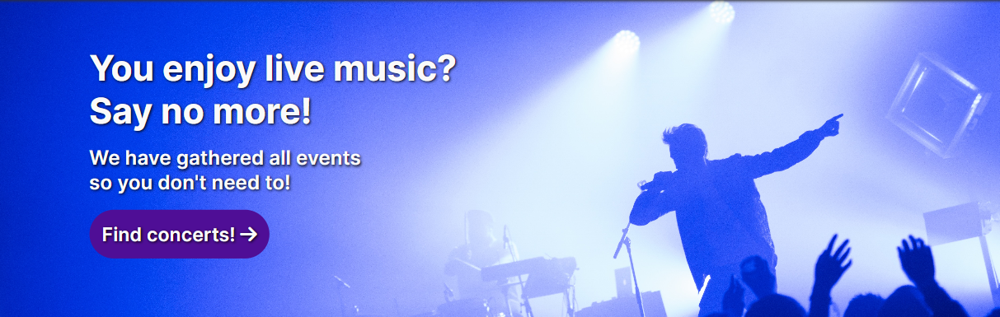

### __About us__

- Under the hero image there is an "About us" section that describes how long Showcase has been active and the vision behind it all.

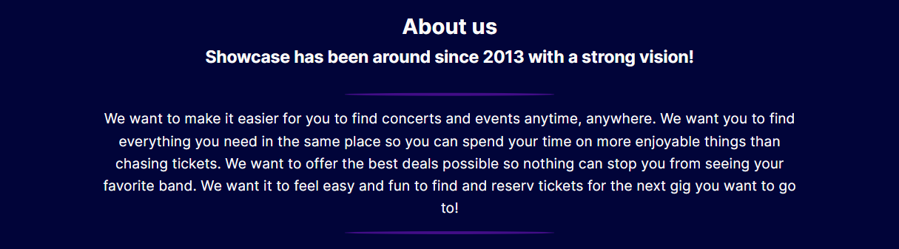

### __Concerts__

- This section has an image of a bassplayer with the text "Concerts. Find the ultimate concert just for you. We have it all!" to make it clear what the next sesction is about.
- Below the image, upcoming concerts are listed with information about band/artist, date, time, place and ticket prices.
- All the events has a button that links to the page that sells the tickets, it opens in a new tab so the user can stay on Showcase's website and look for more tickets.

Image and title of the Concerts section:

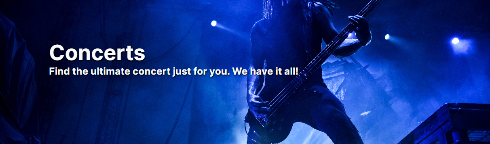

List of upcoming events in Concerts section:

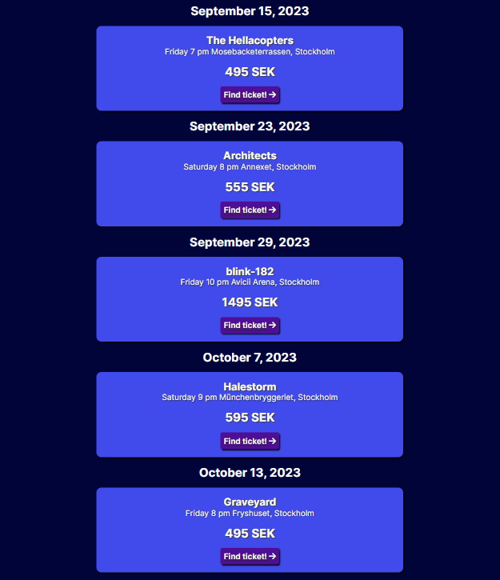

### __Sign up!__

- The user has the option here to sign up for the newsletter, all you have to do is to enter your e-mail address and click on "Sign up!". By doing this you are first to recieve information about upcoming gigs and other updates.

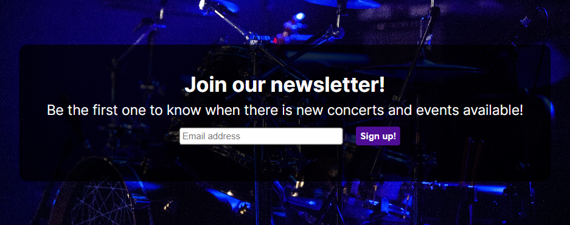

- It's mandatory to enter an email adress and it will show error messages if the field is empty or if it's not an email address.

Error message when it's empty:

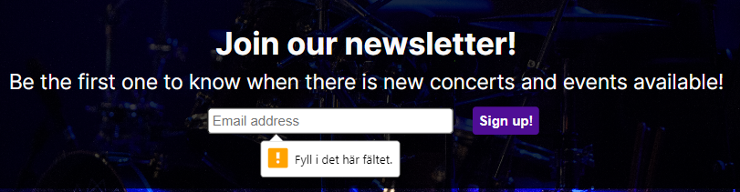

Error message when it's not an email address:

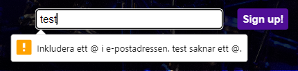

### __Footer__

- The footer contains icons that links to the social media accounts that Showcase uses: Facebook, Instagram and Youtube.
- Information about copyright at the bottom.

## Features left to implement

- In the future I would like to include a search bar both in the navigation bar and in the Concerts section so users easily can search for different kinds of events instead of scrolling through the list.
- I would like to start selling the tickets directly from the page so it no longer would link to other sites but instead handling the tickets and payment directly on the website.
- I would like for some parts to be a video background instead of all images.
- I would like the menu on small devices to hide when you choose a menu option so it doesn't stay open.

# Testing

- The website is tested and works in multiple web browsers: Google Chrome, Microsoft Edge and Firefox.
- It works on mobile devices such as Google Chrome on Android devices and Safari on iPhone.
- The website is responsive and well-functioning on diferrent screen sizes, which is tested by using it on several devices but also Chrome DevTools to see how it adjusts through the different sizes.
- The navigation bar stays at the top of the page and all the links works correctly.
- The button "Find concerts!" links to the Concerts section.
- The buttons on every concert links to the right site in a new tab.
- The form works by entering an email address. The email address field is required and it won't accept anything but an email address.
- The social media icons link to their websites in a new tab.
- The text on the website is easy to read and the colors show good contrast and work well together.
- The layout is correct so nothing is out of place.

## Validator testing

- __HTML:__ No errors were returned by the official W3C Validator. [Results here](assets/readme/html-validated.png)
  
- __CSS:__ No errors were found by the official Jigsaw Validator. [Results here](assets/readme/css-validated.png)

## Bugs

- ### Solved bugs
  
  - In the beginning the icons from Font Awesome didn't work but then I realized that the link at the bottom of of the html file was missing. I added it and that fixed the problem.
  - The W3C Validator complained about that a button had a link in it so I changed it from a button to a link that I styled as a button which was approved.
  - After a while the website looked strange on small screen sizes which turned out to be due to the form being too wide to fit on the page. It was solved by styling the form to fit on the page as planned.

- ### Unfixed bugs
  
  - No known unfixed bugs.

# Deployment

#### The site was deployed to Git Hub pages using the following steps

- In the Github repository, click on the Settings tab.
- Under General, navigate to Code and Automation and select 'Pages'.
- In the Build and Deployment section for Source, select 'Deploy from a branch' from the drop-down list.
- For Branch, select 'main' from the drop-down list and Save.
- On the top of the page, the link to the complete website is provided.
- The deployed site will update automatically upon new commits to the master branch.

# Credits

## Media

- The images used is taken from [Unsplash](https://unsplash.com/).
- The favicon was made 

## Acknowledgments

- To remember how to make the dropdown menu and for help getting started I took inspiration from Code Institute's [Love Running](https://github.com/Code-Institute-Solutions/love-running-2.0-sourcecode/tree/main) project.